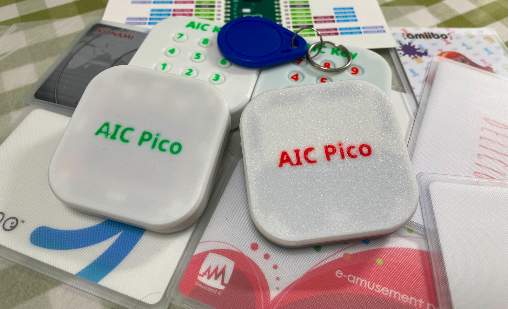
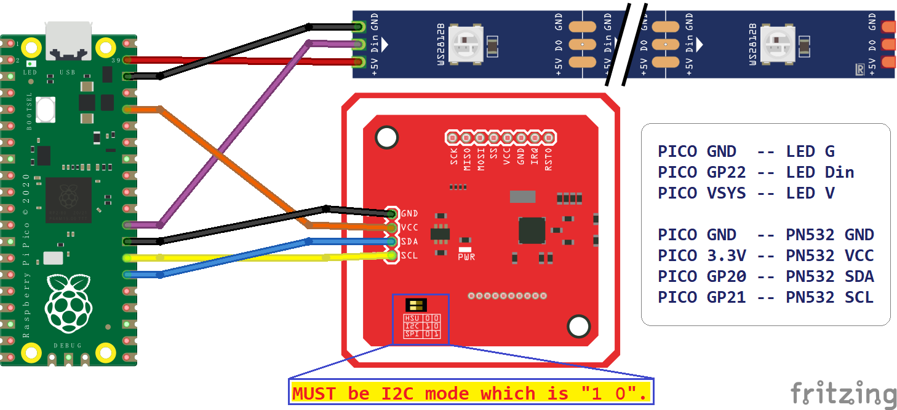
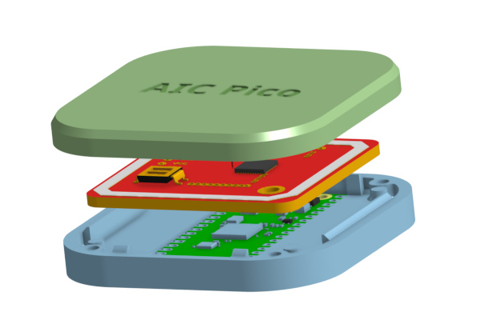
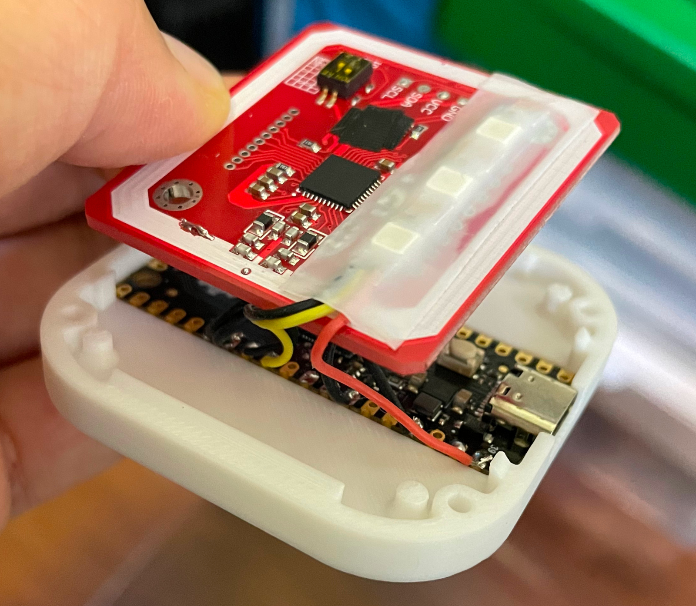
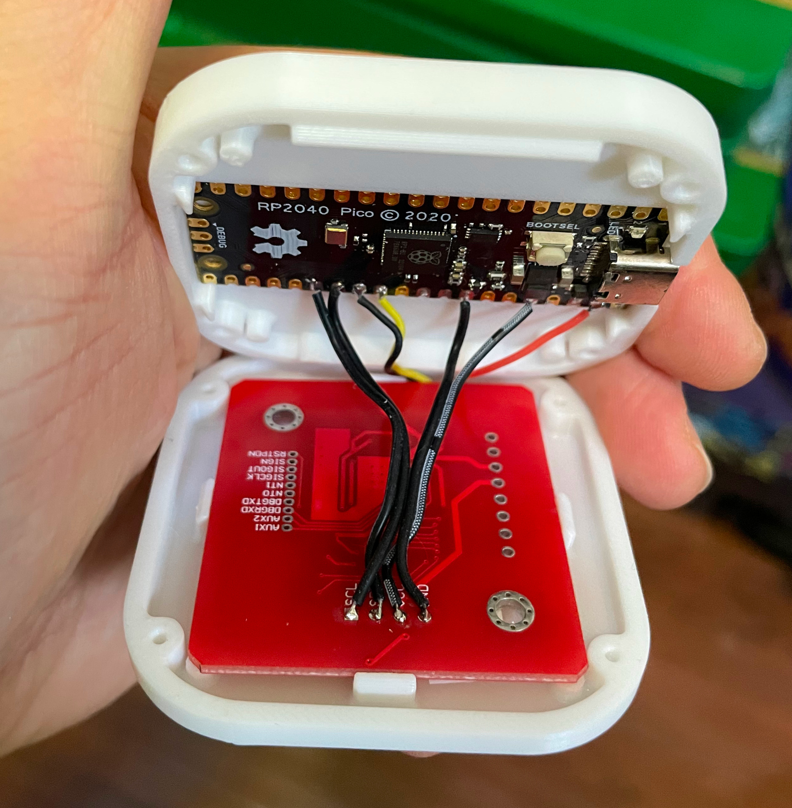
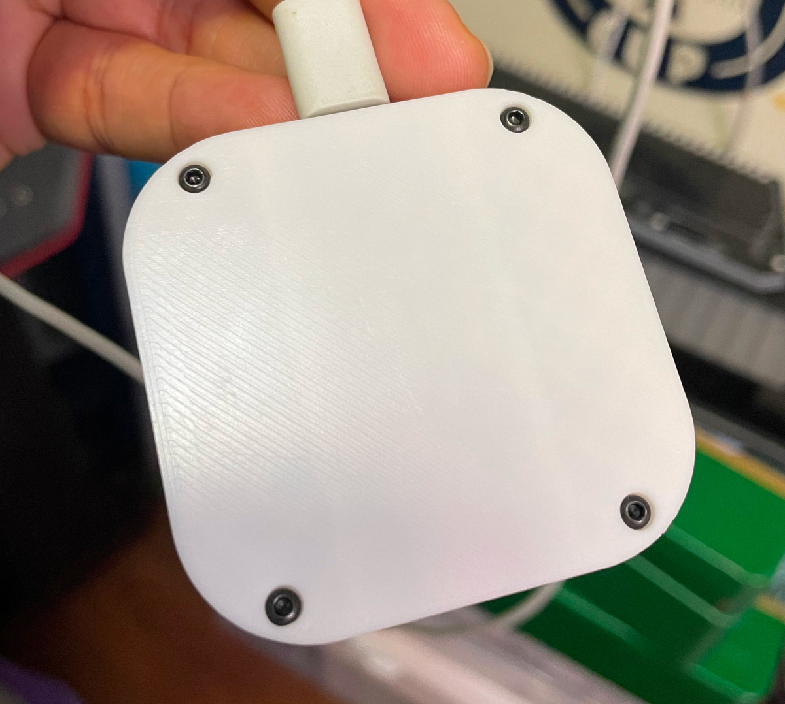

# AIC Pico - Amusement IC Card Reader, AIME & Cardio Emulator

Features:
* It's small, smallest as far as I know.
* Easy to make.
* Sega AIME I/O and Spicetools CardIO emulation.
* Command line of rich features.
* Supported card:
  * ISO/IEC 14443 Type A (Mifare, Felica AIC, Amiibo, etc.)
  * To be updated.
* Emulates virtual AIC from any Mifare cards.
* Variants
  * AIC Pico
  * AIC Key PN532 (see notes below)
  * AIC Key PN5180 (see notes below)
* All source files open.

Notes: Be patient, I'm working on them.

Thanks to many respectful guys/companies who made their tools or materials free or open source (KiCad, OnShape, InkScape, Fritzing, Raspberry things), ChatGPT and GitHub Copilot helped a lot as well.

And thanks to community developers that inspired me and helped me: CrazyRedMachine (https://github.com/CrazyRedMachine) for the Spicetools Card IO part, Sucareto's AIME Reader (https://github.com/Sucareto/Arduino-Aime-Reader) for the AIME protocol part.

## Notes
Check out my other cool projects, they're all great, I promise.
https://github.com/whowechina/

This project:  
* Heavily depends on 3D printing, a Bambu AMS system helps a lot.
* Requires skills to solder tiny components and wires.

## **Disclaimer** ##
I made this project in my personal time with no financial benefit or sponsorship. I will continue to improve the project. I have done my best to ensure that everything is accurate and functional, there's always a chance that mistakes may occur. I cannot be held responsible for any loss of your time or money that may result from using this open source project. Thank you for your understanding.

## About the License
It's CC-NC. So DIY for yourself and for your friend, don't make money from it.

## HOW TO BUILD
Seriously, this is the easiest one among all my Pico series projects.
### Components
* 1x Rasberry Pi Pico or Pico W (clones work too).  
  https://www.raspberrypi.com/products/raspberry-pi-pico
* 1x PN532 Module (the Red Square board version, cheap clones work too).  
  https://www.elechouse.com/product/pn532-nfc-rfid-module-v4/
* Some thin wires.
* Thin WS2812B LED strip.
* 4x M2*8mm screws.

### 3D Prints
* **aic_pico_bottom.stl**  
  The bottom part.

For the top part, choose one that fits your need.
* **aic_pico_top.stl**  
  Regular top part.
* **aic_pico_top_ams.3mf**  
  Regular top part, for multi-color printing.
* **aic_pico_top_tall.stl**  
  Taller top part, so a thicker LED strip can fit.
* **aic_pico_top_tall_ams.3mf**  
  Taller top part, for multi-color printing.

### Assembly
I'll let these images do the talk.

### Firmware
* UF2 file is in `Production\Firmware` folder.
* For the new build, hold the BOOTSEL button while connect the USB to a PC, there will be a disk named "RPI-RP2" showed up. Drag the UF2 firmware binary file into it. That's it. There's a small hole at the bottom side of the Chu Pico, it is facing right to the BOOTSEL button.
* It has a command line to do configuration. You can use this Web Serial Terminal to connect to the USB serial port of the Chu Pico. (Note: "?" is for help)  
  https://googlechromelabs.github.io/serial-terminal/  
* Spicetools cardio (Card I/O) HID is supported;
* SEGA AIME protocol is supported on a second serial port.

## CAD Source File
I'll post when I finish all variants.
