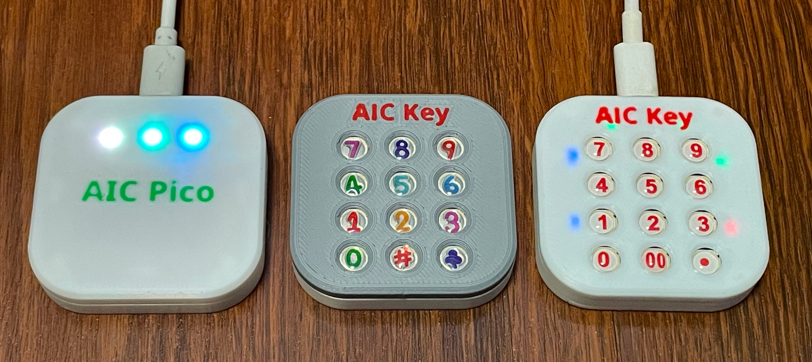

# AIC Pico and AIC Key
**Amusement IC Card Reader, AIME & Cardio Emulator**

[看不懂英文的，点这里切换到中文版](README_CN.md)

**Features:**
* It's small, smallest as far as I know.
* Many variants
  * AIC Pico (PN532)
  * AIC Pico (PN5180, no housing)
  * AIC Key PN532
  * AIC Key PN5180
  * AIC Pico Lib (see notes 1 below)
* Easy to make.
* Sega AIME I/O and Spicetools CardIO emulation.
* Command line for configurations.
* Supported card:
  * FeliCa (Amusement IC)
  * ISO/IEC 14443 Type A (BanaPassport, Mifare, Amiibo, some IC tags, some ID tags, etc.)
  * ISO/IEC 15693 (Old E-Amusement cards), only with PN5180 (see notes 2 below)
* Emulates virtual AIC from any Mifare cards.
* All source files open.

**Notes:**
1. So one can integrate "AIC Pico" into a Raspberry Pi Pico based controller. Will be ready later.  
  
2. PN532 supports only 14443A (Mifare) and FeliCa cards, while PN5180 also supports 15693 cards (old e-Amusement cards).

## Thanks
Thanks to many respectful guys/companies who made their tools or materials free or open source (KiCad, OnShape, InkScape, Fritzing, Raspberry things), ChatGPT and GitHub Copilot helped a lot as well.

And thanks to community developers and projects that helped me a lot: CrazyRedMachine (https://github.com/CrazyRedMachine) for the Spicetools Card IO part, Sucareto's AIME Reader (https://github.com/Sucareto/Arduino-Aime-Reader) for the AIME protocol part, .NET nanoFramework (https://github.com/nanoframework) for the PN5180 part.

## Warning
This project:  
* Heavily depends on 3D printing, a Bambu AMS system helps a lot.
* Requires skills to solder tiny components and wires.

## Check Out My Other Projects
You can also check out my other cool projects.

* Popn Pico: https://github.com/whowechina/popn_pico
* IIDX Pico: https://github.com/whowechina/iidx_pico
* IIDX Teeny: https://github.com/whowechina/iidx_teeny
* Chu Pico: https://github.com/whowechina/chu_pico
* Mai Pico: https://github.com/whowechina/mai_pico
* Diva Pico: https://github.com/whowechina/diva_pico
* AIC Pico: https://github.com/whowechina/aic_pico

## **Disclaimer** ##
I made this project in my personal time with no financial benefit or sponsorship. I will continue to improve the project. I have done my best to ensure that everything is accurate and functional, there's always a chance that mistakes may occur. I cannot be held responsible for any loss of your time or money that may result from using this open source project. Thank you for your understanding.

Check out my other projects at my GitHub homepage.
https://github.com/whowechina/

## About the License
It's CC-NC. So DIY for yourself and for your friend, don't make money from it.

## Building "AIC Pico (PN532)"
Seriously, this is the easiest one among all my Pico series projects.
### Components
* 1x Rasberry Pi Pico or Pico W (clones work too).  
  https://www.raspberrypi.com/products/raspberry-pi-pico
* 1x PN532 Module (the Red Square board version, cheap clones work too).  
  https://www.elechouse.com/product/pn532-nfc-rfid-module-v4/
* Some thin wires.
* Thin WS2812B LED strip.
* 4x M2*8mm screws.

### 3D Prints
* **aic_pico_bottom.stl**  
  The bottom part.

For the top part, choose one that fits your need.
* **aic_pico_top.stl**  
  Regular top part.
* **aic_pico_top_ams.3mf**  
  Regular top part, multi-color printing.
* **aic_pico_top_tall.stl**  
  Taller top part, so a thicker LED strip can fit.
* **aic_pico_top_tall_ams.3mf**  
  Taller top part, multi-color printing.

### Wiring

### Assembly
I'll let these images do the talk.

#### Notes
* The firmware supports up to 64 LEDs on the WS2812B LED strip. I personally used 3 as shown in main title image. But you can have different LED number, as long as they fit within the housing.
* LED might be excessively bright even at low settings, consider covering it with some filter tape.
* The mode switch on PN532 must be in "I2C" mode, picture below shows the correct settings.  
  

## Building "AIC Pico (PN5180)"
If you opt for the PN5180 NFC module, note that the housing design is up to you. Ensure it fits your design or you can use it without a case. Be prepared to solder more wires compared to the PN532 version.

### Wiring

Note: WS2812B LED Strip wiring is the same as the PN532 version.

## Building "AIC Key"
AIC Key is a variation of the AIC Pico - a keypad is integrated. Much more difficult to build than the "AIC Pico" as it has many tiny components to solder.

### Components
* 1x Rasberry Pi Pico or Pico W (clones work too).  
  https://www.raspberrypi.com/products/raspberry-pi-pico

* For NFC modules, choose one of the following options:
  * 1x PN532 Module (the red square board version, cheap clones work too).  
    https://www.elechouse.com/product/pn532-nfc-rfid-module-v4/
  * 1x PN5180 Module (the blue rectangle version, cheap clones work too). PN5180 supports ISO/IEC 15693 (old e-amusement cards).  
    

* For LEDs, you also have 3 options:
  * Option 1: 6x side-light WS2812B 1204 LEDs (D1 to D6) and a 10ohm 0603 resistor (R1), GREEN mark in the assemble image.
  * Option 2 (avaiable only for PN532 version): 6x WS2812C-2020 LEDs (D13 to D18), BLUE mark in the assemble image.
  * Option 3: 6x regular single-color 0603 LEDs (D7 to D12) and 6x 100ohm 0603 resistors (R2 to R7), PURPLE mark in the assemble image.

* For switches, you still have 2 option:
  * Option 1: 12x ALPS SKRRAAE010 low-profile TACT switch.  
    https://www.mouser.com/ProductDetail/Alps-Alpine/SKRRAAE010?qs=m0BA540hBPeKhAe3239t1w%3D%3D
  * Option 2: 12x Panasonic EVQP1K05M 6mm square tactile switch.  
    https://www3.panasonic.biz/ac/e/dl/catalog/index.jsp?series_cd=3473&part_no=EVQP1K05M

* 1x Right angle 2.54mm pitch header, 4P for PN532, 13P for PN5180.  
  

* 1x Stickers of numbers. You can find some customize sticker service, or you can find some existing stickers. I found this Bonito crystal 3D stickers super helpful for this project.  
    
  

* PCB, just visit JLCPCB (https://jlcpcb.com/) and place an order there. Leave everything default, 1.6mm thickness, whatever color you like. PCB gerber files are in "Production/PCB" folder. For PN532 version, use "aic_key_pn532_v*.zip", for PN5180 version, use "aic_key_pn5180_v*.zip".  
  

### 3D Prints
* **aic_key_bottom.stl**  
  Bottom part.
* **aic_key_top_surface.stl**  
  Top part for Alps surface switches.
* **aic_key_top_surface_ams.3mf**  
  Top part for Alps surface switches, multi-color printing.
* **aic_key_top_tact.stl.stl**  
  Top part for Panasonic tact switches.
* **aic_key_top_tact_ams.3mf**  
  Top part for Panasonic tact switches, multi-color printing.

### Assembly
Again I'll let these images do the talk. Remember to upload the firmware onto Raspberry Pi Pico before assemble.

#### General Part

#### PN532 Version
Remember set to I2C mode first.

#### PN5180 Version
You need to cut off the original antenna and use the one in our PCB.

#### Final Assembly
You may use some instant adhesive to fix stickers.

## Firmware
* UF2 file is in `Production\Firmware` folder.
* There're several ways to boot into firmware update mode:
  * For the new build, hold the BOOTSEL button while connect the USB to a PC, there will be a disk named "RPI-RP2" showed up. Drag the UF2 firmware binary file into it. That's it.
  * If there's already a working firmware, you can use "update" command in command line to update the firmware in the future, so you don't need to open the housing.
  * If there's already a working firmware later than 2023-12-02, you can also press "00" key and "·" key (or directly ground the GPIO10 and the GPIO11) at the same time when plug in the USB cable, it will boot into firmware update mode.
* You can use this Web Serial Terminal to connect to the main USB serial port of the board which is the command line interface. (Note: "?" is for help)  
  https://googlechromelabs.github.io/serial-terminal/
* Spicetools cardio (Card I/O) HID is supported;
* SEGA AIME protocol is supported on a second serial port.
* Some command line commands:
  * "light \<rgb|led|both|off\>" to turn on or off the LEDs.
  * "level <0..255> <0..255>" to adjust the brightness.
  * "nfc" manually to detect cards.
  * "update" reboot into firmware update mode.
* Given my limited hobby time, the firmware may not be fully tested. Please report any anomalies.

## Card ID Logic
To support many different NFC cards and tags, card IDs are transformed following these rules.
### AIME
* 15693 => 0x01 + last 7 bytes of UID
* MIFARE (4-byte UID) => 0x01 + 0x01 + UID + first 2 bytes of the UID
* MIFARE (7-byte UID) => 0x01 + UID
* FeliCa => Original IDm
### CardIO
* 15693 => original UID
* MIFARE (4-byte UID) => 0xE0 + 0x04 + UID + first 2 bytes of the UID
* MIFARE (7-byte UID) => 0xE0 + UID
* FeliCa => Original IDm

## 3D Model Source File (Onshape)
https://cad.onshape.com/documents/ca5497f91b2962105335e822/w/7b88022e98c02c60ad0c44a7/e/c3476efd13c08f807f3773fe?configuration=List_6ARRO0azcgmmHg%3D__&renderMode=1&rightPanel=configPanel&uiState=6558cabf9b380560ca5b554e
