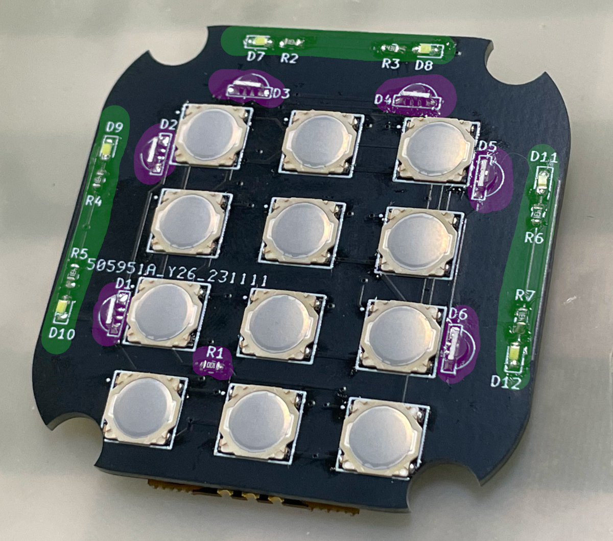

# AIC Pico and AIC Key
**Amusement IC Card Reader, AIME & Cardio Emulator**

Features:
* It's small, smallest as far as I know.
* Easy to make.
* Sega AIME I/O and Spicetools CardIO emulation.
* Command line for configurations.
* Supported card:
  * Felica (Amusement IC)
  * ISO/IEC 14443 Type A (BanaPassport, Mifare, Amiibo, some IC tags, some ID tags, etc.)
  * To be updated.
* Emulates virtual AIC from any Mifare cards.
* Variants
  * AIC Pico
  * AIC Key PN532
  * AIC Key PN5180 (see notes 1 below)
  * AIC Pico Lib (see notes 2 below)
* All source files open.

Notes:
1. Be patient, I'm working on PN5180 firmware. It may take quite a while.
2. So one can integrate "AIC Pico" into a Raspberry Pi Pico based controller. Will be ready when I finish AIC Key.  
  

Thanks to many respectful guys/companies who made their tools or materials free or open source (KiCad, OnShape, InkScape, Fritzing, Raspberry things), ChatGPT and GitHub Copilot helped a lot as well.

And thanks to community developers that inspired me and helped me: CrazyRedMachine (https://github.com/CrazyRedMachine) for the Spicetools Card IO part, Sucareto's AIME Reader (https://github.com/Sucareto/Arduino-Aime-Reader) for the AIME protocol part.

## Notes
Check out my other cool projects, they're all great, I promise.
https://github.com/whowechina/

This project:  
* Heavily depends on 3D printing, a Bambu AMS system helps a lot.
* Requires skills to solder tiny components and wires.

## **Disclaimer** ##
I made this project in my personal time with no financial benefit or sponsorship. I will continue to improve the project. I have done my best to ensure that everything is accurate and functional, there's always a chance that mistakes may occur. I cannot be held responsible for any loss of your time or money that may result from using this open source project. Thank you for your understanding.

## About the License
It's CC-NC. So DIY for yourself and for your friend, don't make money from it.

## BUILDING "AIC Pico"
Seriously, this is the easiest one among all my Pico series projects.
### Components
* 1x Rasberry Pi Pico or Pico W (clones work too).  
  https://www.raspberrypi.com/products/raspberry-pi-pico
* 1x PN532 Module (the Red Square board version, cheap clones work too).  
  https://www.elechouse.com/product/pn532-nfc-rfid-module-v4/
* Some thin wires.
* Thin WS2812B LED strip.
* 4x M2*8mm screws.

### 3D Prints
* **aic_pico_bottom.stl**  
  The bottom part.

For the top part, choose one that fits your need.
* **aic_pico_top.stl**  
  Regular top part.
* **aic_pico_top_ams.3mf**  
  Regular top part, for multi-color printing.
* **aic_pico_top_tall.stl**  
  Taller top part, so a thicker LED strip can fit.
* **aic_pico_top_tall_ams.3mf**  
  Taller top part, for multi-color printing.

### Assembly
I'll let these images do the talk.

#### Notes
* The firmware supports up to 16 LEDs on the WS2812B LED strip. I personally used 3 as shown in main title image. But you can experiment with different LED numbers, as long as they fit within the housing.
* LED might be excessively bright even at low settings, consider covering it with some filter tape.
* The mode switch on PN532 must be in "I2C" mode, picture below shows the correct settings.  
  

## BUILDING "AIC Key"
AIC Key is a variation of the AIC Pico - a keypad is integrated. Much more difficult to build than the "AIC Pico" as it has many tiny components to solder.

### Components
* 1x Rasberry Pi Pico or Pico W (clones work too).  
  https://www.raspberrypi.com/products/raspberry-pi-pico

* For NFC modules, you have 2 options:
  * 1x PN532 Module (the red square board version, cheap clones work too).  
    https://www.elechouse.com/product/pn532-nfc-rfid-module-v4/
  * 1x PN5180 Module (the blue rectangle version, cheap clones work too). PN5180 supports ISO/IEC 15693 (old e-amusement cards).  
    

* For LEDs, you also have 2 options:
  * Option 1: 6x side-light WS2812B 1204 LEDs (D1~D6) and a 10ohm 0603 resistor (R1), GREEN mark in the assemble image.
  * Option 2: 6x regular single-color 0603 LEDs (D7~D12) and 6x 100ohm 0603 resistors (R2~R7), PURPLE mark in the assemble image.

* 12x ALPS SKRRAAE010 low-profile TACT switch.  
  https://www.mouser.com/ProductDetail/Alps-Alpine/SKRRAAE010?qs=m0BA540hBPeKhAe3239t1w%3D%3D

* 1x Right angle 2.54mm pitch header, 4P for PN532, 13P for PN5180.  
  

* 1x Stickers of numbers. You can find some customize sticker service, or you can find some existing stickers. I found this Bonito crystal 3D stickers super helpful for this project.  
    
  

### 3D Prints
* **aic_key_bottom.stl**  
  The bottom part.
* **aic_key_top.stl**  
  Top part.
* **aic_key_top_ams.3mf**  
  Same top part, but for multi-color printing.

### Assembly
Again I'll let these images do the talk. Remember to upload the firmware onto Raspberry Pi Pico before assemble.

#### General Part

#### PN532 Version
Remember set to I2C mode first.

#### PN5180 Version
You need to cut off the original antenna and use the one in our PCB.

#### Final Assembly
You may use some instant adhesive to fix stickers.

## Firmware
* UF2 file is in `Production\Firmware` folder.
* For the new build, hold the BOOTSEL button while connect the USB to a PC, there will be a disk named "RPI-RP2" showed up. Drag the UF2 firmware binary file into it. That's it.
* It has a command line to do configuration. You can use this Web Serial Terminal to connect to the main USB serial port of the board. (Note: "?" is for help)  
  https://googlechromelabs.github.io/serial-terminal/
* You can use "update" command in command line to update the firmware in the future, so you don't need to open the housing.
* Spicetools cardio (Card I/O) HID is supported;
* SEGA AIME protocol is supported on a second serial port.
* Some command line commands:
  * "light \<rgb|led|both|off\>" to turn on or off the LEDs.
  * "level <0..255> <0..255>" to adjust the brightness.
  * "nfc" manually to detect cards.
  * "update" reboot into firmware update mode.
* Given my limited hobby time, the firmware may not be fully tested. Please report any anomalies.

## CAD Source File
I'll post when I finish all variants.
